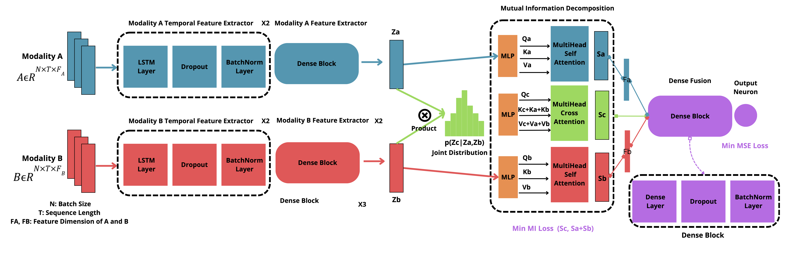

# DF-DM: A foundational process model for multimodal data fusion in the artificial intelligence era.

[](LICENSE)

This repository contains two use cases for the DF-DM model. A domestic violence report prediction for Public Health, and diabetic rethinopathy prediction for retina fundus photos images.

## Table of Contents

- [Introduction](#introduction)
- [Setup](#setup)
- [Usage](#usage)
- [Data](#data)
- [Analysis](#analysis)
- [Contributing](#contributing)
- [License](#license)

## Introduction

### The DF-DM Framework
There are a lot of fields that can benefit from multimodal data fusion, in health case 2 common cases are the Public Health tasks such as domestic violence prediction, and clinical tasks such as diabertic retinopathy diagnosis, where data also obtained from multiple sources and modalities. To solve this kind of problems we propouse a framework that not only combines data, but also provides all the good practices to avoid bias and harm. the Data Fusion for Data Mining (DF-DM) framework is a foundational process model for multimodal data fusion in the artificial intelligence as can be seen in the following figure:


This framework leverages state-of-the-art foundational models for vector embedding extraction of high dimensional data. Then uses a multimodal data fusion approach to combine the embeddings. The framework is flexible and can be adapted to other multimodal data fusion tasks.


The framework was evaluated in two use cases:

### Domestic Violence Report Prediction: 
The goal of this use case is to predict the number of domestic violence reports in Colombia. The dataset is composed of satellite images and social media data. The dataset is composed of:
- Violence reports from the police. Weekly reports in 10 cities in Colombia from 2018 to 2023.
- Satellite images from the same cities and time period extracted using Sentinel Hub.
- Internet data from the same cities and time period. The data is composed of:
    - Google Trends data: Contains the number of searches for the term "domestic violence" and violence in the same cities and time period.
    - Media Cloud Data: Contains the number of news related to domestic violence in the same cities and time period.
    - GDELT Data: Contains the number of news related to domestic violence in the same cities and time period.

Our framewk also provides the code to train and extract embeddings from a variational autoencoder for satellite images embedding extraction:


All the experiments can be seen in the directory Violence. For the fusion, we used a proposed temporal multimodal data fusion model:



## Setup

### Prerequisites

Before running the code, ensure you have the following installed:

- Python 3.8.15
- Required Python packages (specified in `requirements.txt`)

### Installation

1. Clone the repository:

```bash
git clone https://github.com/dsrestrepo/DF-DM.git
cd DF-DM
```

2. Create a virtual environment (optional but recommended):

```bash
python -m venv venv
source venv/bin/activate  # On Windows: venv\Scripts\activate
```

3. Install dependencies:

```bash
pip install -r requirements.txt
```

4. Set up your OpenAI API (Optional) key if you'll use GPT as foundational model:

Create a `.env` file in the root directory.

Add your OpenAI API key to the `.env` file:

```makefile
OPENAI_API_KEY=your_api_key_here
```
Make sure you have a valid OpenAI API key to access the language model.

5. Set up your Sentinel Hub APIs to get the Satellite Images:

You'll get those in your profile in your sentinell hub account.

```makefile
CLIENT_ID = your_client_id
CLIENT_SECRET = your_client_secret
```


## Data

This project uses 2 datasets. You'll find instructions and code about to extract each dataset in `get_datasets.ipynb`:

1. Gender Violence Dataset: A dataset of internet data such as social media or google searches, and satellite images to predict gender violence. The codes can be used to extract a dataset for other tasks and cities. The codes to extrac the dataset are avaibale in: `datasets/violence_prediction`.

* Satellite: To download the satellite images go to `datasets/violence_prediction/Satellite`. There you'll find the satellite extractor, this code uses the [Sentinel Hub API](https://www.sentinel-hub.com/develop/api/). Take into account that the satellite extractor requires the coordinates of the Region of Interes (ROI). You can use the file `Coordinates/get_coordinates.ipynb` to generate the ROI of your specific location. There is also a `DataAnalysis.ipynb` to assess the quality of the images.

* Metadata: The labels are located in the directory `datasets/violence_prediction/Metadata`. The labels were downloaded from open public data sources through the number of police reports of domestic violence reported in Colombia  from January 1, 2010 to August 28, 2023. You can find information about the data sources in the `data_sources.txt`. Use the `get_dataset.ipynb` to preprocess and merge the data sources, and the `Data_Analysis.ipynb` to run a data analysis.

* Internet data: Internet data is under `datasets/violence_prediction/Internet`. The internet data is composed of 3 sources: Google Trends, Media Cloud, and GDELT. The data is composed of the number of searches for the term "domestic violence" and violence in the same cities and time period. The data is also composed of the number of news related to domestic violence in the same cities and time period. The data sources are:

    * Google Trends: The data was downloaded from [Google Trends](https://trends.google.com/trends/?geo=CO). The data was downloaded using the `get_dataset.ipynb` notebook. The data was downloaded from January 1, 2010 to August 28, 2023. The data is composed of the number of searches for the term "domestic violence" and violence in the same cities and time period.

    * Media Cloud: The data was downloaded from [Media Cloud](https://mediacloud.org/). The data was downloaded from January 1, 2018 to January 1, 2023. The data is composed of the number of news related to domestic violence in the titles.

    * GDELT: The data was downloaded from [GDELT](https://www.gdeltproject.org/). The data was downloaded from January 1, 2018 to January 1, 2023. The data is composed of the number of news related to violence indicators in the same cities and time period.

2. [BRSET Dataset](https://physionet.org/content/brazilian-ophthalmological/1.0.0/): The Brazilian Multilabel Ophthalmological Dataset (BRSET) is a valuable resource designed to enhance scientific development and validate machine learning models in ophthalmology. With 16,266 retinal fundus images from 8,524 Brazilian patients, it includes demographic information, anatomical parameters, quality control measures, and multi-label annotations. This dataset empowers computer vision models to predict demographic characteristics and classify diseases, making it a pivotal tool for advancing research and innovation in ophthalmological machine learning.

## Usage

1. Get the dataset: Use the notebook `get_datasets.ipynb`. Functions and code to extract and preprocess each dataset were created.

2. Extract the embeddings: 


* To extract text embeddings you can use Models with support to Open AI API such as GPT 3.5, GPT-4, or comeds with support to the llama cpp package such as LLAMA 2 7B, LLAMA 2 13B, LLAMA 2 70B, or Mistral 7B 

* To extract image embeddings you can use a set of foundational computer vision models such as vision transformer, convnext, Dino V2, among others. Aditionally you can train a variational autoencoder or autoencoder to generate embeddings from the images. The code to train and extract embeddings from a variational autoencoder for satellite images embedding extraction is available in `train_self-supervised.ipynb` and `generate_image_embeddings.ipynb`.

Run the models: The models used to predict and evaluate the DF-DM model are available in the directory `Violence`, and `BRSET`.


## Contributing
Contributions to this research project are welcome. To contribute:

1. Fork the repository.
2. Create a new branch for your feature or research.
3. Make your changes.
4. Create tests.
5. Submit a pull request.


## License
This project is licensed under the MIT License.


## Contact

For any inquiries or questions regarding this project, please feel free to reach out:

- **Email:** davidres@mit.edu
